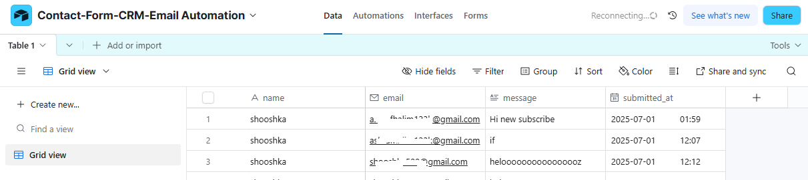
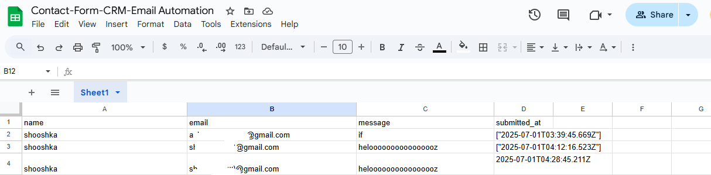
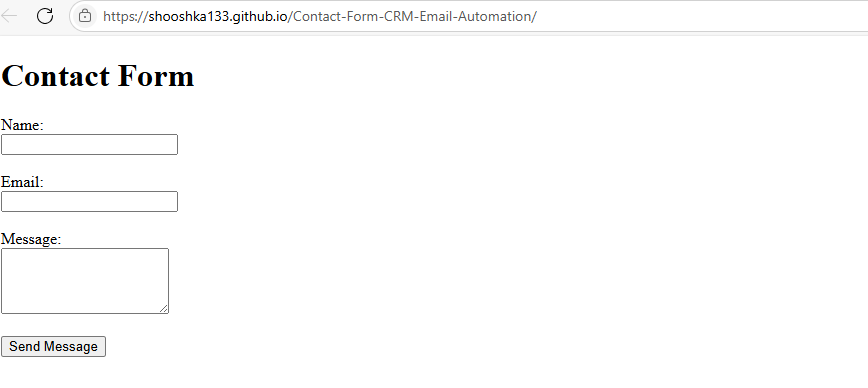
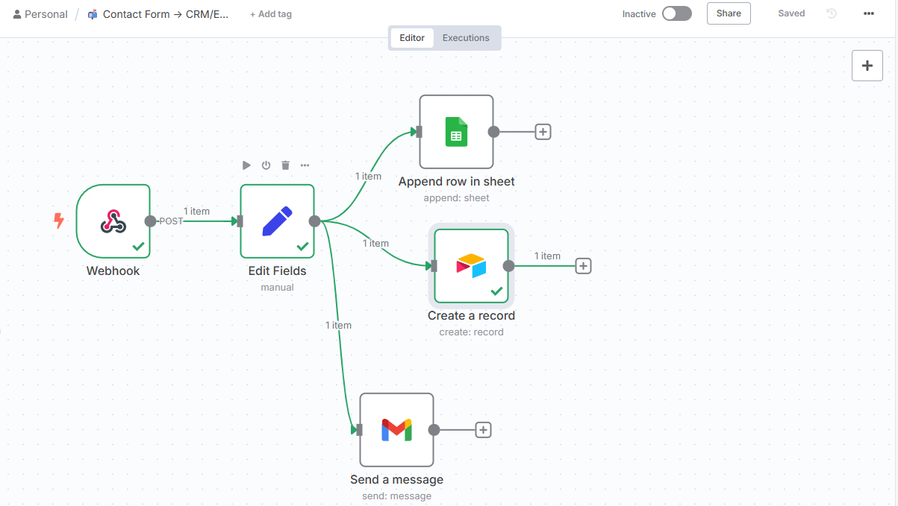

# 📬 Contact Form CRM & Email Automation (n8n + Google Sheets + Airtable + Gmail)

Easily capture leads from a contact form hosted on GitHub Pages and automate the storage, tracking, and confirmation email sending using **n8n**, **Google Sheets**, **Airtable**, and **Gmail**.

---

## 🔧 What It Does

- Captures contact form submissions via a public HTML form
- Sends an automated thank-you email to the user
- Appends data to:
  - 📄 Google Sheets
  - 📋 Airtable
- Timestamps each entry

---

## 🛠️ Tools Used

| Tool         | Purpose                     |
|--------------|-----------------------------|
| `n8n`        | Core workflow automation    |
| `Google Sheets` | Lead storage & backup     |
| `Airtable`   | CRM-friendly interface       |
| `Gmail`      | Send confirmation email      |
| `GitHub Pages` | Hosts the contact form    |

---

## ⚙️ Setup Instructions

### 1. Deploy the Contact Form

- Host `index.html` (form) using GitHub Pages  
- Make sure the form action is pointed to your **n8n webhook URL**:
  ```html
  <form action="https://your-n8n-domain/webhook/your-workflow-id" method="POST">
  ```

### 2. Configure the n8n Workflow

- Create a new workflow in `n8n`
- Nodes used:
  - **Webhook**: Receives form POST
  - **Set**: Formats data and adds timestamp
  - **Google Sheets Append Row**: Stores lead
  - **Airtable Create Record**: Stores CRM entry
  - **Email**: Sends thank-you message to user
- Make sure to authenticate with:
  - Google Sheets OAuth
  - Airtable personal access token
  - Gmail account or SMTP credentials

### 3. Update Google Sheet & Airtable Structure

Both Google Sheet and Airtable should contain these fields:

- `name`
- `email`
- `message`
- `submitted_at` (Date/Time field)

> 🔁 Use `{{ [new Date().toISOString()] }}` to generate the timestamp value inside the Set node.

---

## ✅ Live Demo Result

Below is a sample output of the automation in action:

### 🔢 Airtable Records



### 📬 Email Confirmation Sent


### 📄 Google Sheet



### 🌐 Live Form



### 🔁 n8n Workflow



---

## 🧠 Extend Ideas

- Add validation or spam filtering
- Push leads to Notion or Trello
- Schedule summary report emails
- Use OpenAI to auto-categorize messages
- Integrate with CRMs like HubSpot or Pipedrive

---

## 📂 Files in Repo

- `index.html` → The public contact form
- `Contact_Form_Workflow.json` → Exported n8n workflow
- `/screenshots` → Visuals of form + output
- `README.md` → You’re reading it

---

## 🔐 Privacy Notice

For demo purposes, test emails and Airtable screenshots may contain mock or obfuscated data.

---

## 🧩 License

MIT License
